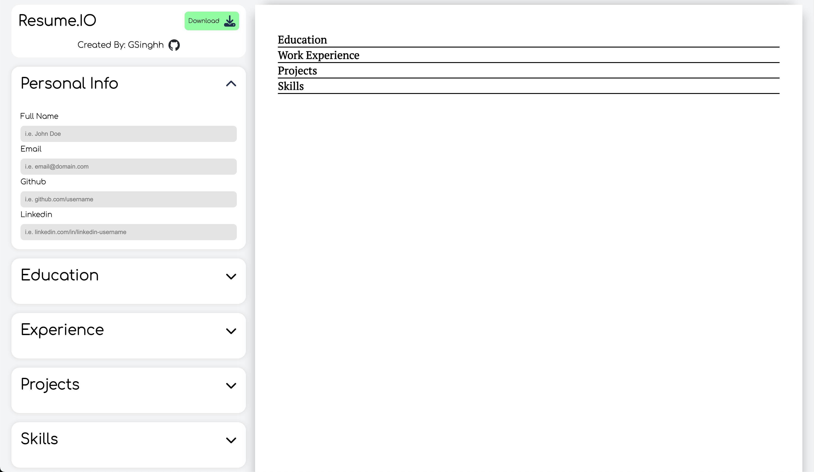

# Resume/CV Generator

### [Deployed on Vercel 🚀](https://cv-application-five.vercel.app)

This resume generator is the perfect web application for students and new grads who want a resume made quick without having to go through the struggles of formatting on google docs/word etc. This resume templates follows the Jake's Resume template which is very popular in the field of software engineering. Users can add in all of their relevant information and export within the matter of a few minutes.

# Preview

# Features

1. User-friendly interface that makes it easy to input and download.

2. Allows inputting of personal information, education, work experience, skills.

3. Live preview of resume.

# Built With
- Vite + React
- CSS

# Getting Started

Assuming you have npm installed, you will need to:

1. Clone this project:  
   `git clone https://https://github.com/GSinghh/cv-application.git`

2. Change into repository directory: 
   `cd cv-application` 

3. Once you have cloned this project, you can install the required dependencies by using:  
   `npm install`

4. A live demo of the project can be started by using:  
   `npm run dev`
